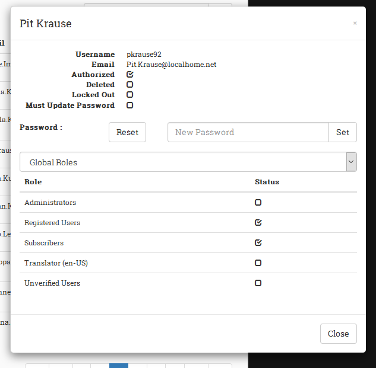

# UserAccess PersonaBar Extension
#### By DNN Connect Association

The above grid searches on *all* columns

## A common issue

If you're like me the most frequent question I get asked from the sites I manage is

"I can't log in, can you help me?'"

And it is as irritating as it is understandable. Due to the many layers of security in DNN, it is not uncommon
for someone to lose their access to the site. And as an administrator you know you have to plow through all
these layers to find out where things went wrong.

A popup shows all relevant info for a user

This is a PersonaBar extension attempts to help you with these cases. It allows you to quickly find an account
and show the most crucial parts for user access:

- Has the user account been approved (authorized)?
- Is the user account deleted?
- Has the account been locked out?

Next to this you can manage the user's password: changing, sending a reset email and specifying that the user
needs to change the password at next login.

Finally you can see all the security and group roles of the portal and set or remove the user's access.

